# Serverless Unified Observability Done Right: I wrote a Tutorial so you Don't Have To!

## Intro

Observability is a foundational practice that helps answer critical questions about your system's health and performance.

- **Is it available?**
- **Is it responding correctly?**
- **Is it fast enough?**

But nowadays observability must bridge the gap between the technical and the business perspective.

- **Is the user journey successful?**
- **Is the business process efficient?**
- **Is it generating value?**

In a cloud-native world, where serverless architectures are gaining popularity, these questions become even more crucial. Without proper design and observability, the advantages of serverless can quickly become pitfalls, resulting in increased costs, degraded performance, security vulnerabilities, and complex debugging scenarios.

#### The Challenge

Like many others, I rely on cloud-native reference architectures to build my serverless applications. However, when it comes to observability, it challenging to locate a comprehensive resource that demonstrates e2e best practices for instrumenting serverless with OpenTelemetry and effectively connecting the traces, metrics, and logs streamed from cloud vendors.

In this article, I'll share my **Unified Observability for AWS Serverless Stack Tutorial** based on payment system, which showcases all the lessons learned, from **setting up** the AWS stack (`API Gateway`, `Lambda`, `SQS`, `DynamoDB`, etc.) using `Terraform`, to **instrumenting** the code with `OpenTelemetry`, and finally to **consolidating** all observability signals into a single `Dynatrace` platform.

**Why a payment system?**
To ensure this tutorial reflects real-world complexity, I have implemented a Serverless Payment System handling the pay-in flow demo lab of an e-commerce marketplace. I chose a payment processing flow because its forces us to tackle the challenges of:

- **Distributed complexity** (A single transaction spans API Gateways, Lambda functions, queues, databases, and external Payment Service Provider (PSP))
- **Strict correctness** (Financial transactions require strict correctness and auditability)
- Has **complex error scenarios** (How to trace complex error scenarios like network failures, PSP timeouts, insufficient funds, etc.)

Note: While this architecture follows industry best practices, its primary purpose is to demonstrate observability instrumentation. It is a robust reference implementation, not a production-ready payment system.

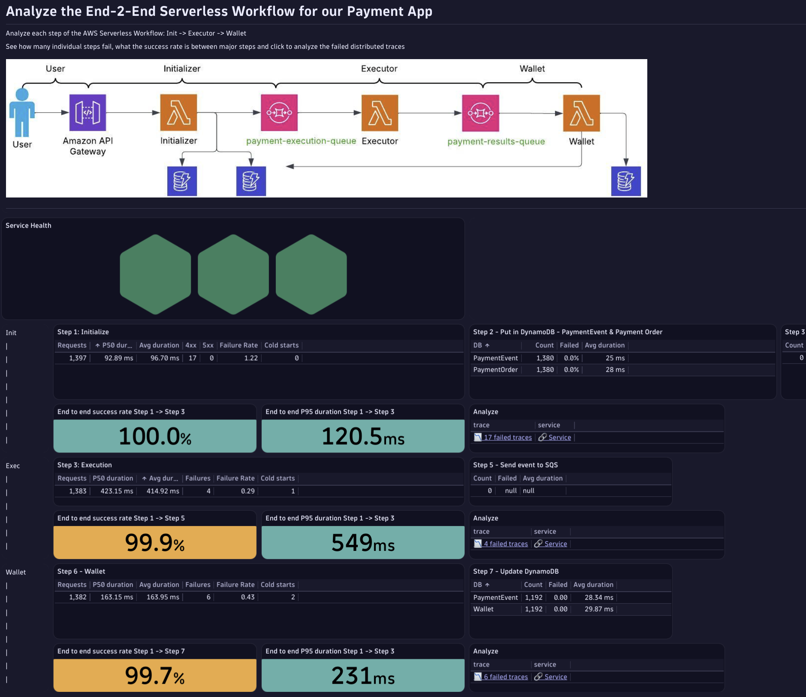

## 4 Steps to Unified Observability

Unified observability doesn't happen all at once. It evolves in clear, intentional steps, each focusing on solving a different category of problems. This tutorial follows a layered approach that builds from infrastructure visibility to business insights:

| Step  | Layer          | Key Question                                | What You Get                                                         |
| ----- | -------------- | ------------------------------------------- | -------------------------------------------------------------------- |
| **1** | Infrastructure | Is the system up?                           | AWS Cloud Monitoring, Clouds App topology, service health dashboards |
| **2** | Application    | What did the request do? Why did it break?  | Distributed tracing, automatic instrumentation, log correlation      |
| **3** | Business       | Did we make money? Is the business healthy? | Business events, conversion rates, revenue metrics, business KPIs    |
| **4** | SDLC/Release   | What changed? Which deployment caused it?   | Release observability, deployment correlation, version tracking      |

This continuous feedback loop between engineering, operations, and business is what we call **Unified Observability**.

> **Key Insight**: Context is the most critical piece in modern observability. Without it, you're hunting through logs and guessing.

## Observability lab - components

### Payment System Reference Architecture

Before diving into the technical implementation, it's important to understand the business flow that this system demonstrates. In real-world e-commerce platforms like Amazon or eBay, the payment flow is broken down into two distinct stages:

#### Pay-in Flow

**When**: Customer clicks "Place Order"  
**Money Movement**: Buyer's credit card → Platform's bank account  
**Platform Role**: Money custodian (holds funds on behalf of seller)  
**Trigger**: Immediate (order placement)  
**Components**: Initializer → Executor → PSP → Wallet → Ledger _(not implemented in demo)_

At this stage, the platform acts as a **money custodian** – while the money is in the platform's account, the seller owns most of it, and the platform only takes a fee.

#### Pay-out Flow (not implemented in demo)

**When**: Products delivered and conditions met  
**Money Movement**: Platform's bank account → Seller's bank account  
**Platform Role**: Disburser (transfers seller's entitled funds)  
**Trigger**: Business event (delivery confirmed)

### Architecture

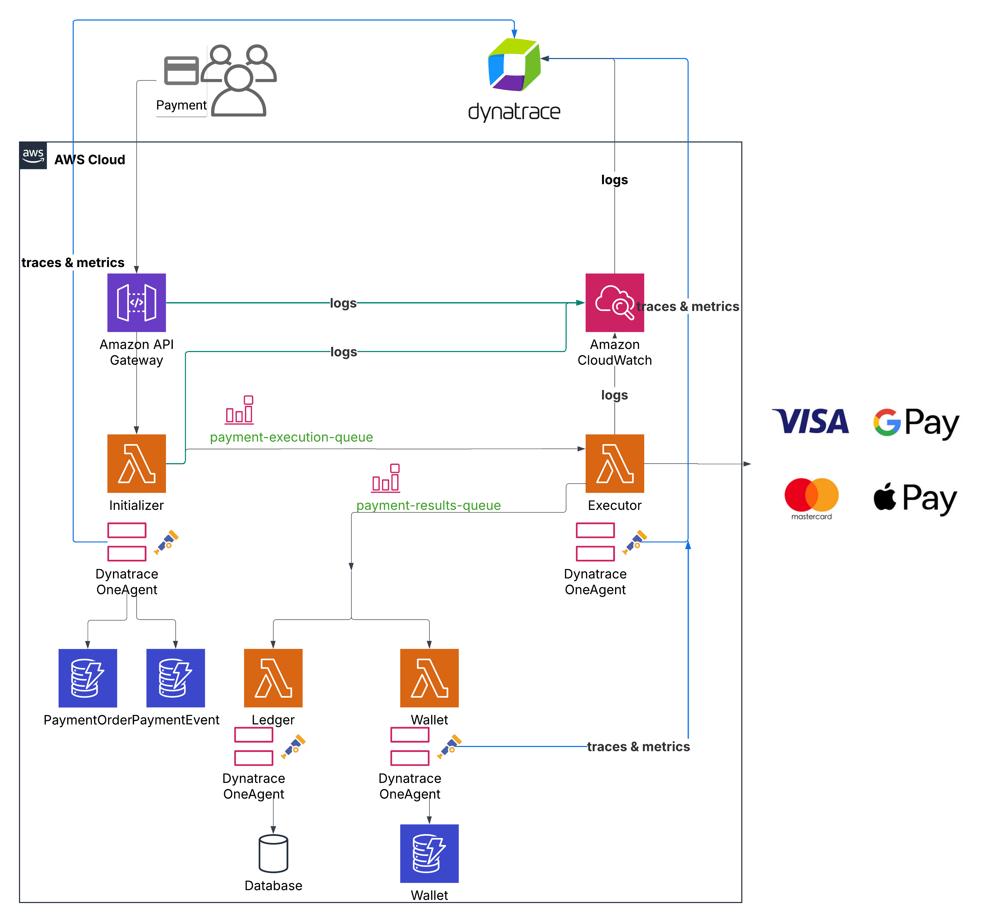

#### Architecture Overview

The payment processing system is built on AWS serverless technologies and follows an event-driven, asynchronous architecture:

### System Components at a Glance

| Component                 | Type            | Purpose                                        |
| ------------------------- | --------------- | ---------------------------------------------- |
| `o11y-lab-initializer`    | API Gateway     | Entry point for payment requests               |
| Payment Initializer       | Lambda (Python) | Validates requests, stores data, enqueues work |
| `payment-execution-queue` | SQS             | Decouples initializer and executor             |
| Payment Executor          | Lambda (Python) | Orchestrates PSP calls, handles responses      |
| PSP (Mock)                | Lambda (Python) | Simulates external payment provider            |
| `payment-results-queue`   | SQS             | Decouples executor and wallet service          |
| Wallet Service            | Lambda (Python) | Updates merchant balances and payment status   |
| `PaymentEvent`            | DynamoDB        | Stores checkout-level data                     |
| `PaymentOrder`            | DynamoDB        | Stores individual order items                  |
| `Wallet`                  | DynamoDB        | Maintains merchant balance ledger              |

### Key Identifiers

- **`checkout_id`**: Unique identifier for a customer's checkout session (can contain multiple orders)
- **`payment_order_id`**: Unique identifier for an individual seller's order within a checkout
- **`merchant_id`**: Unique identifier for a seller/merchant account in the Wallet table

### API Endpoint

- **`POST /v1/payments`**: Create new payment

**Key Design Decisions:**

- **Request-response with async processing**: API synchronously returns 202 after enqueuing to SQS. Downstream processing (Executor → PSP → Wallet) happens asynchronously
- **Queue-based decoupling**: Two SQS queues enable independent scaling and failure isolation
- **Batch processing**: Lambda Powertools BatchProcessor handles multiple messages per invocation
- **Separate tables**: Three-table design separates concerns - `PaymentEvent` (checkout metadata), `PaymentOrder` (execution status tracking), `Wallet` (merchant balance ledger)
- **Mock PSP**: In-process PSP simulation enables realistic payment flow demo without external dependencies
- **Error simulation**: Built-in simulation capabilities for testing observability and resilience

#### Simplified pay-in flow steps

1.  **Step 1**: Payment event creation.
    A customer submits a payment request via the API Gateway.
    **Result**: A checkout is created with one or more payment orders (marketplace)

2.  **Step 2**: Payment initialization.
    The `Payment Initializer` (Payment Service):
    - validates the request using Pydantic models (data validation),
    - stores checkout metadata in DynamoDB `PaymentEvent` table (partition key `checkout_id`),
    - creates individual payment orders in `PaymentOrder` table with status `NOT_STARTED` (one per seller),
    - enqueues execution message to Amazon SQS queue `payment-execution-queue` with aggregated payment data

| **Attribute**      | **Type**  | **Description**                                |
| ------------------ | --------- | ---------------------------------------------- |
| `checkout_id`      | `string`  | A global unique identifier for the checkout    |
| `buyer_info`       | `map`     | Buyer details (`user_id`, `email`)             |
| `seller_info`      | `map`     | Mapping of payment_order_id to seller_account  |
| `credit_card_info` | `map`     | Tokenized credit card information              |
| `is_payment_done`  | `boolean` | Whether the entire checkout has been processed |

Table 1: Checkout metadata - DynamoDB PaymentEvent table (PK: `checkout_id`)

| **Attribute**          | **Type**  | **Description**                                          |
| ---------------------- | --------- | -------------------------------------------------------- |
| `payment_order_id`     | `string`  | Unique identifier for individual payment order           |
| `checkout_id`          | `string`  | Reference to parent checkout (GSI)                       |
| `buyer_account`        | `string`  | Buyer's user ID                                          |
| `amount`               | `string`  | Transaction amount (Decimal as string)                   |
| `currency`             | `string`  | Transaction currency                                     |
| `payment_order_status` | `string`  | Status (`NOT_STARTED`, `SUCCESS`, `FAILED`, `EXECUTING`) |
| `ledger_updated`       | `boolean` | Whether ledger has been updated (reserved)               |
| `wallet_updated`       | `boolean` | Whether wallet has been updated                          |

Table 2: Individual payment orders - DynamoDB PaymentOrder table (PK: `payment_order_id`, GSI: `checkout_id-index`)

3.  **Step 3**: Payment execution.
    Once the message is enqueued, Amazon SQS triggers the `Payment Executor` Lambda via an event source mapping.
    **Payment Order Status**: Updated from `NOT_STARTED` to `EXECUTING`

**3.1 Payment Executor (executes payment orders via PSP)**

- Triggered by messages from the `payment-execution-queue` (async decoupling).
- Uses AWS Lambda Powertools for batch processing
- Calls the PSP (Payment Service Provider) via HTTP API with the aggregated payment amount.
- The PSP moves money from buyer's credit card to **platform's bank account** (pay-in).
- Uses `payment_order_id` as idempotency key to prevent duplicate charges.
- Receives success/failure response from PSP.
- Updates `payment_order_status` to `SUCCESS` or `FAILED`.
- Enqueues result message to `payment-results-queue`.

**3.2 PSP Integration (Payment Service Provider Mock)**

**Integration Method**: This demo uses a **lambda function** to simulate PSP.

**PSP Integration Pattern Posibility**:
. **Hosted Payment Page**

- PSP provides iframe/widget for card collection
- Card data never touches your servers
- No PCI DSS compliance burden
- Reduced security risk
- Less UX control

**Demo implementation details**:

- Simulates external payment providers like Stripe, PayPal, Adyen, or card schemes (Visa, MasterCard)
- Implemented as a Lambda function exposed via API Gateway (represents external HTTP API)
- Introduces random latency (0.1-0.5 seconds) to simulate network delays
- Supports configurable error simulation for observability testing:
  - `simulate.psp.error`: Payment failure
  - `simulate.psp.server_error`: PSP unavailable (HTTP 500)
  - `simulate.psp.error_code`: Specific error (`INSUFFICIENT_FUNDS`, `CARD_DECLINED`, etc.)

**3.3 Wallet Service (tracks seller entitlements)**

- Triggered by messages from the `payment-results-queue`.
- Uses AWS Lambda Powertools for batch processing.
- Queries `PaymentOrder` table using GSI (`checkout_id-index`) to find all orders for the checkout.
- Updates merchant balances in the `Wallet` table based on payment results:
  - **On SUCCESS**: Credits each seller's wallet with their payment order amount
  - **On FAILED**: Marks payment orders as failed (no wallet update)
- Updates `payment_order_status` and `wallet_updated` for each order in the `PaymentOrder` table.
- Updates `ledger_updated` field (reserved for future double-entry bookkeeping).
- Marks the checkout as complete (`is_payment_done = true`) in the `PaymentEvent` table.

### 3.4 Reconciliation System

**Purpose**: Ensures data consistency between internal services and external PSP by periodically comparing states.

**Why It Matters**:

- Asynchronous communication can cause state divergence
- External PSP failures may not be immediately visible
- Regulatory compliance requires audit trails
- Detection of edge cases (partial failures, network issues during commit)

**Implementation Approach** (recommended for production):

1. **Daily Settlement Files**: PSP sends settlement files containing transaction records
2. **Ledger Comparison**: Reconciliation service compares PSP records vs. internal ledger
3. **Mismatch Detection**: Three categories of discrepancies:
   - **Classifiable + automatable**: Auto-correction via scripts (e.g., timing differences)
   - **Classifiable + manual**: Finance team queue (e.g., known PSP issues)
   - **Unclassifiable**: Investigation queue (requires root cause analysis)

**Observability Integration**:

- Track reconciliation job completion in Dynatrace
- Alert on mismatch count exceeding threshold (e.g., >10 discrepancies)
- Dashboard tile showing daily reconciliation status (green/yellow/red)
- Monitor reconciliation latency (how long it takes to identify issues)

**Current Demo Status**: Not implemented (out of scope for observability demo)

For production systems, implement reconciliation using:

- Scheduled Lambda (EventBridge cron trigger, e.g., daily at 2 AM)
- S3 bucket for PSP settlement files
- DynamoDB table for mismatch tracking and audit trail
- Step Functions for multi-stage reconciliation workflow

| **Attribute** | **Type** | **Description**                                                          |
| ------------- | -------- | ------------------------------------------------------------------------ |
| `merchant_id` | `string` | Unique identifier for the merchant/seller (also called `seller_account`) |
| `balance`     | `number` | Current wallet balance (Decimal) – represents amount **owed** to seller  |
| `currency`    | `string` | Wallet currency (ISO 4217 format: USD, EUR, GBP, etc.)                   |
| `updated_at`  | `number` | Unix timestamp of last update (Decimal for precision)                    |

Table 3: Merchant wallet balances - DynamoDB Wallet table (PK: `merchant_id`)

#### Summary of Queue Architecture

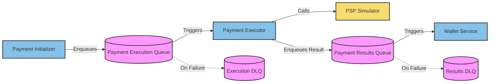
```mermaid
flowchart LR
    Init[Payment Initializer] -->|Enqueues| ExQueue[(Payment Execution Queue)]
    ExQueue -->|Triggers| Exec[Payment Executor]
    Exec -->|Calls| PSP[PSP Simulator]
    Exec -->|Enqueues Result| ResQueue[(Payment Results Queue)]
    ResQueue -->|Triggers| Wallet[Wallet Service]

    ExQueue -.->|On Failure| DLQ1[(Execution DLQ)]
    ResQueue -.->|On Failure| DLQ2[(Results DLQ)]

    classDef queue fill:#f9f,stroke:#333,stroke-width:2px;
    classDef lambda fill:#85C1E9,stroke:#333,stroke-width:2px;
    classDef psp fill:#F7DC6F,stroke:#333,stroke-width:2px;

    class ExQueue,ResQueue,DLQ1,DLQ2 queue;
    class Init,Exec,Wallet lambda;
    class PSP psp;
```

This implementation uses Amazon SQS to decouple the payment processing components:

- **Payment Execution Queue**: Decouples initialization from execution. Includes a Dead-Letter Queue (DLQ) for failed messages.
- **Payment Results Queue**: Decouples execution from wallet updates. Includes a DLQ for reliability.
- **Batch Processing**: Both consumers process messages in batches for efficiency.

## Overview of the key components

### 1. API Gateway – The Entry Point

**Role:**

- Handles all HTTP/HTTPS requests coming into the application.
- Integrates with AWS Lambda to build scalable, event-driven workflows.

**Key observability and troubleshooting points:**

- `Count` total number of API requests in a given period.
- `4xx errors` typically indicate client-side issues (e.g., invalid request parameters or authorization failures).
- `5xx errors` suggest backend or configuration problems, often related to service availability or performance bottlenecks.
- `Latency` measures overall response speed of the API.
- `Integration latency` highlights delays or performance issues specifically at the backend level (e.g., Lambda function execution times).

Together, these metrics and error codes provide a clear starting point for debugging and performance tuning.

### 2. AWS Lambda – Serverless Compute

AWS Lambda runs code in response to events without the need to manage servers. It scales automatically based on the number of incoming events such as HTTP requests, changes data in S3 bucket, DynamoDB tables or scheduled tasks.

**Role:**

- Executes business logic on demand.

**Key metrics include:**

- `Failure rate` measures failed execution over total invocations
- `Execution duration` shows how long each function run takes, which is critical for optimizing performance and costs
- `Concurrent execution count` - indicates how many Lambda functions are running in parallel
- `Number of invocations` - reflects overall usage
- `Throttles` indicate when your function hits concurrency limits
- `IteratorAge` is particularly important for event-driven functions processing streams from services like Kinesis or DynamoDB. This metric indicates how far behind your function is from processing the latest events in the stream.
- `ColdStart` occurs when AWS Lambda must initialize a new execution environment for your function

**Best Practices for Cold Start Monitoring**

**_Key metrics to track:_**

- Cold start frequency (percentage of invocations affected)
- Cold start duration distribution
- Impact on end-to-end latency
- Correlation with traffic patterns and deployment events

**_Optimization strategies based on monitoring:_**

- `Artifact Size Reduction`: Monitor how deployment package size affects cold start times
- `Memory Configuration`: Track performance improvements from memory allocation changes
- `Provisioned Concurrency`: Use monitoring data to determine optimal provisioned capacity
- `Runtime Selection`: Compare cold start performance across different language runtimes

These metrics deliver insights into application performance and can guide optimizations.

**2025 Cold Start Optimization Landscape:**

While cold starts remain a consideration for serverless architectures, the toolkit for managing them has evolved significantly:

- **Provisioned Concurrency**: The gold standard for latency-sensitive payment flows. It eliminates cold starts by keeping environments initialized.
- **SnapStart & Init Snapshots**: Technologies expanding in 2025 (initially Java/.NET) that snapshot initialized memory states, offering up to 90% faster startups.
- **VPC Networking**: Hyperplane ENIs have effectively eliminated the historical "VPC tax" on cold starts.
- **Python Specifics**: For Python runtimes, meaningful reductions come from **lazy imports** (deferring heavy library loads until needed), **optimal memory allocation** (more memory = more CPU during init), and minimizing deployment package sizes.

### 3. Amazon SQS – queue-based decoupling

**Role:**

- Decouples the `Payment Initializer` and `Payment Executor` using a durable, scalable queue (`payment-execution-queue`).
- Decouples the `Payment Executor` and `Wallet Service` using a second queue (`payment-results-queue`).
- Enables retry and failure isolation via DLQs for both queues.
- Supports batch processing with configurable batch size.

**Why SQS (Single-Receiver Pattern)?**

For this demo, SQS provides the right balance of simplicity and reliability:

| Pattern                   | Use Case                                   | Trade-off                         |
| ------------------------- | ------------------------------------------ | --------------------------------- |
| **SQS (Single Receiver)** | Each message processed by one consumer     | Simple, exactly-once delivery     |
| Kafka (Multi-Receiver)    | Same message consumed by multiple services | Complex, requires consumer groups |

**Demo Rationale**:

- Each payment message needs exactly one handler (not broadcast)
- Built-in dead-letter queue support for failed messages

**Payment State Machine**:

The payment processing follows a clear state machine:

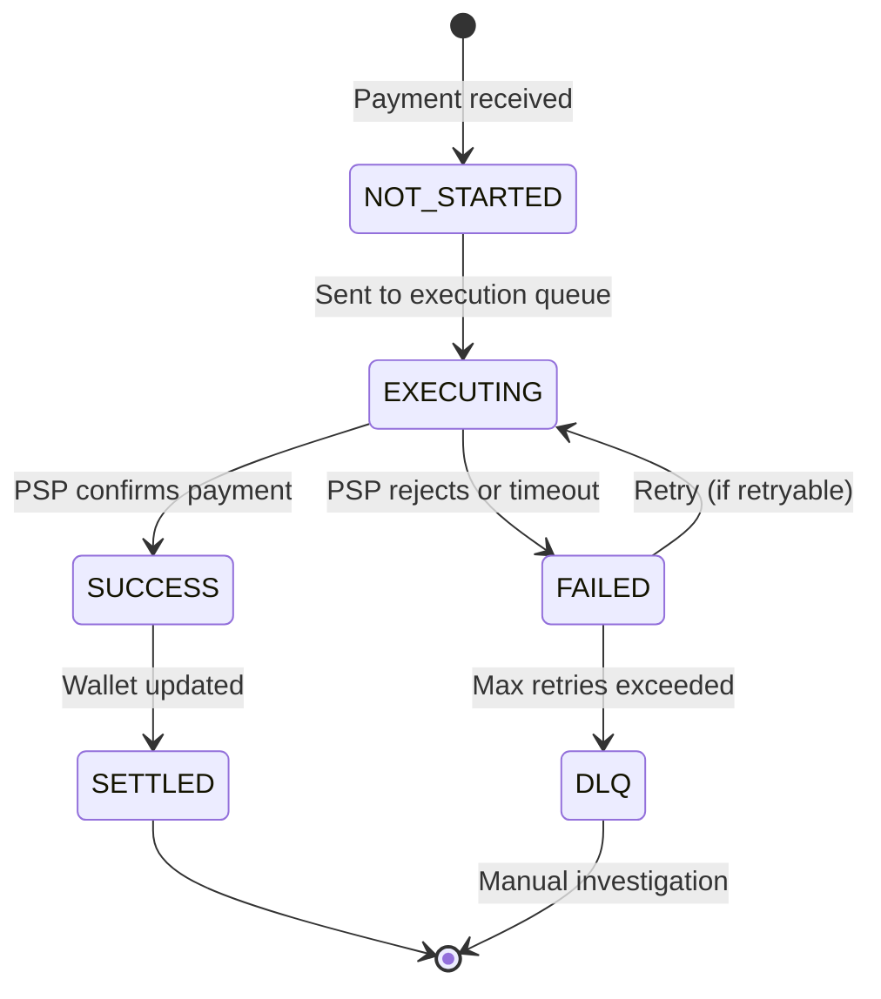
```mermaid
stateDiagram-v2
    [*] --> NOT_STARTED: Payment received
    NOT_STARTED --> EXECUTING: Sent to execution queue
    EXECUTING --> SUCCESS: PSP confirms payment
    EXECUTING --> FAILED: PSP rejects or timeout
    FAILED --> EXECUTING: Retry (if retryable)
    FAILED --> DLQ: Max retries exceeded
    SUCCESS --> SETTLED: Wallet updated
    SETTLED --> [*]
    DLQ --> [*]: Manual investigation
```

**State Persistence**:

- `payment_order_status` field in PaymentOrder table tracks current state
- State transitions generate business events for observability
- Recovery possible from any state on Lambda restart

**Key metrics:**

- `MessagesSent`, `MessagesReceived`, and `MessagesDeleted` form the core message flow metrics. These help you understand the complete lifecycle of messages in your queue and identify processing bottlenecks.
- `ApproximateNumberOfMessagesVisible`: is the most fundamental metric for SQS monitoring. This metric tracks the number of messages available for retrieval from the queue.
- `ApproximateAgeOfOldestMessage` indicates how long the oldest message has been waiting in the queue. This metric is crucial for identifying processing delays and potential consumer issues.
- DLQ metrics for poison-pill detection and failed message analysis.

### 4. Amazon DynamoDB – NoSQL database

**Role:**

- Stores payment data across three purpose-built tables:
  - **`PaymentEvent`**: Holds checkout-level data (buyer info, seller mapping, payment completion status)
  - **`PaymentOrder`**: Stores individual payment order items with GSI on `checkout_id` for efficient queries
  - **`Wallet`**: Maintains merchant balance
- All tables use on-demand billing (`PAY_PER_REQUEST`) for automatic scaling
- Enables efficient querying through primary keys and global secondary indexes

**Key DynamoDB metrics:**

- `ConsumedReadCapacityUnits/ConsumedWriteCapacityUnits` track actual throughput usage
- `ProvisionedReadCapacityUnits/ProvisionedWriteCapacityUnits` monitor allocated capacity
- `ReadThrottledRequests/WriteThrottledRequests` identify capacity bottlenecks
- `SuccessfulRequestLatency` measure response times for operations
- `SystemErrors/UserErrors` track error rates and types

**Data Model and Relationships:**

The three-table design optimizes for different access patterns:

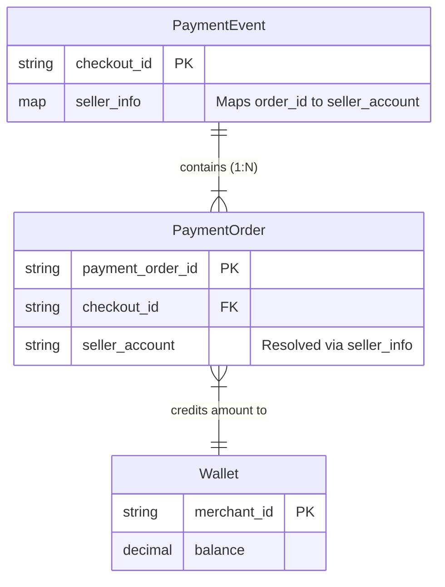
```mermaid
erDiagram
    PaymentEvent ||--|{ PaymentOrder : "contains (1:N)"
    PaymentEvent {
        string checkout_id PK
        map seller_info "Maps order_id to seller_account"
    }
    PaymentOrder {
        string payment_order_id PK
        string checkout_id FK
        string seller_account "Resolved via seller_info"
    }
    Wallet {
        string merchant_id PK
        decimal balance
    }
    PaymentOrder }|--|| Wallet : "credits amount to"
```

**Access Patterns:**

1. **Create checkout**: Write to `PaymentEvent`, batch write to `PaymentOrder`
2. **Retrieve checkout**: Read `PaymentEvent` by `checkout_id`
3. **Find orders for checkout**: Query `PaymentOrder` GSI by `checkout_id`
4. **Update order status**: Update `PaymentOrder` by `payment_order_id`
5. **Credit merchant**: Atomic ADD to `Wallet` by `merchant_id`

**Consistency Model:**

- **Idempotency**: `payment_order_id` acts as idempotency key to prevent double-crediting

**Database Selection Rationale:**

This demo uses **DynamoDB (NoSQL)** for the following reasons:

- **Native AWS integration**: Seamless with Lambda, perfect for serverless architectures
- **Automatic scaling**: On-demand billing eliminates capacity planning
- **Built-in observability**: CloudWatch metrics
- **Demonstration focus**: Showcases distributed tracing across multiple AWS services

**Production considerations**: In real financial systems, you would evaluate **relational databases with ACID transactions**.
For an observability demo, DynamoDB's native AWS integration provides the best showcase of distributed tracing patterns.

**Double-Entry Bookkeeping Principles**

While this demo uses a simplified ledger model (Wallet table only), production payment systems follow **double-entry accounting**, where every transaction affects two accounts:

| Account | Debit | Credit |
| ------- | ----- | ------ |
| Buyer   | $50   |        |
| Seller  |       | $50    |

**Key Properties**:

- Sum of all debits = Sum of all credits (zero-sum)
- Provides end-to-end traceability
- Ensures consistency throughout payment cycle
- Enables financial reconciliation and audit trails

**Current Implementation**:

- `ledger_updated` field in PaymentOrder table is reserved for future ledger service integration
- Wallet service currently acts as a simplified ledger (tracks seller balances only)
- For production: Implement immutable ledger service (see Square's Books: [Immutable Double-Entry Accounting Database](https://developer.squareup.com/blog/books-an-immutable-double-entry-accounting-database-service/))

**Observability Impact**:

- Ledger updates should generate business events for audit trails
- Track ledger vs. wallet consistency via scheduled DQL queries
- Alert on discrepancies between ledger entries and wallet balances

### 6. Amazon CloudWatch

**Role:**

- Central service for collecting metric, logs, and events across AWS resources

## Retry Strategies

**Current Implementation**: AWS Lambda/SQS built-in retry with visibility timeout.

**Flow**:

```
1st failure → message becomes invisible (visibility timeout)
2nd failure → message returns, Lambda retries with reduced concurrency
3rd failure (maxReceiveCount) → move to DLQ
```

**Retry Strategies**:

| Strategy               | Description                 | Use Case          |
| ---------------------- | --------------------------- | ----------------- |
| **Visibility Timeout** | Fixed delay by queue config | Async Processing  |
| **Cancel**             | Stop retrying               | Permanent failure |

**Why Visibility Timeout?**

- Simple mechanism for async processing
- Gives downstream services time to recover (fixed window)
- Standard SQS/Lambda integration pattern

**Observability:**

In the context of retry strategies, observability might focuses on two key areas: **PSP Error Rates** (why retries happen) and **Dead Letter Queue (DLQ) Analysis** (when retries fail).

**1. PSP Error Rate Analysis**

This DQL query calculates the success rate of your PSP interactions.

```dql
fetch logs
| parse content, "JSON:json"
| filter json[event_type] == "payment.psp.response"
| summarize
    total = count(),
    errors = countIf(
        json[outcome] == "FAILURE"
    ),
| fieldsAdd error_rate = (errors / total) * 100
| fieldsAdd sli = 100 - ((errors / total) * 100)
```

**2. Dead Letter Queue (DLQ) Monitoring**

Monitoring DLQs is critical because a message landing in a DLQ means your retry strategy has completely failed.

- **Alerting on Dead Payments** (`ApproximateNumberOfMessagesVisible`)
  A value greater than 0 indicates a "dead" payment requiring manual intervention. Use this for high-priority alerts.

  ```dql
  timeseries counter = max(cloud.aws.sqs.ApproximateNumberOfMessagesVisible.By.QueueName),
  by: {QueueName, aws.account.id, aws.region, dt.smartscape_source.id},
  filter:{matchesValue(aws.account.id, $AccountId) AND
          matchesValue(aws.region, $Region) AND
                   matchesValue(dt.smartscape_source.id, $InstanceId)
                   OR matchesValue($InstanceId, "ALL")}
  | sort counter desc
  | limit toLong($Limit)
  ```

- **Trend Analysis** (`NumberOfMessagesSent`)
  Analyze the rate at which messages are sent to DLQ. A sudden spike (e.g., >10% of traffic) suggests a systemic failure (broken code or PSP outage). This measures the **Failed Transactions Rate**.

  ```dql
  timeseries counter = sum(cloud.aws.sqs.NumberOfMessagesSent.By.QueueName),
  by: {QueueName, aws.account.id, aws.region, dt.smartscape_source.id},
  filter:{matchesValue(aws.account.id, $AccountId) AND
          matchesValue(aws.region, $Region) AND
                   matchesValue(dt.smartscape_source.id, $InstanceId)
                   OR matchesValue($InstanceId, "ALL")}
  | sort counter desc
  | limit toLong($Limit)
  ```

- **Operational SLA** (`ApproximateAgeOfOldestMessage`)
  This metric measures your **Time to React**. If a message sits in the DLQ for >24h, it indicates that the operations team is not responding to incidents in a timely manner.

  ```dql
  timeseries counter = max(cloud.aws.sqs.ApproximateAgeOfOldestMessage.By.QueueName),
  by: {QueueName, aws.account.id, aws.region, dt.smartscape_source.id},
  filter:{matchesValue(aws.account.id, $AccountId) AND
          matchesValue(aws.region, $Region) AND
                   matchesValue(dt.smartscape_source.id, $InstanceId)
                   OR matchesValue($InstanceId, "ALL")}
  | sort counter desc
  | limit toLong($Limit)
  ```

# Deployment Architecture

The entire infrastructure is defined as code using Terraform, enabling center around automation, consistency, and efficiency in infrastructure deployments.

### Infrastructure Organization

**Directory Structure:**

```
infrastructure/
├── environments-main/          # Account-level resources (IAM, S3, Dynatrace integration)
├── payment-bootstrap/          # Payment system deployment
│   ├── databases.tf           # DynamoDB table definitions
│   ├── sqs.tf                 # SQS queue configurations
│   ├── initializer.tf         # Initializer Lambda + API Gateway
│   ├── finalizer.tf           # Executor Lambda
│   ├── wallet.tf              # Wallet Lambda
│   ├── psp.tf                 # PSP Lambda + API Gateway
│   └── openapi_*.json         # API Gateway OpenAPI specifications
└── modules/                   # Reusable Terraform modules
    ├── terraform-aws-lambda-zip/
    ├── terraform-aws-apigateway/
    ├── terraform-aws-dynamodb/
    └── terraform-aws-sqs/
```

Let's kickstart this adventure - setting up the environment

## Infrastructure Bootstrapping Guide

Deploy the O11y Lab Serverless Payments infrastructure

### Prerequisites

| Tool/Resource   | Version       | Purpose                                              |
| --------------- | ------------- | ---------------------------------------------------- |
| **AWS Account** | -             | Active AWS account with billing enabled              |
| **IAM User**    | -             | User with programmatic access                        |
| AWS CLI         | Latest        | AWS                                                  |
| Terraform       | v1.14         | Infrastructure provisioning                          |
| Docker          | v29.1.1       | Lambda package building (Linux x86_64 compatibility) |
| Make            | Pre-installed | Build automation (Linux/macOS; Windows: use WSL)     |

> **Note**: Ensure your IAM user has adequate permissions.

### Deployment Order & Requirements

**STEP 0:** Create Terraform State Bucket (manual/one-time)

**STEP 1:** Configure Terraform Backend (S3 remote state)

- Create: `infrastructure/environments-main/backend.tf`
- Create: `infrastructure/payment-bootstrap/backend.tf`

**STEP 2:** Deploy environments-main

- Requires: `environments-dev.auto.tfvars`

**STEP 3:** Build & Upload Lambda packages

- Requires: `.env` (in project root)

**STEP 4:** Deploy payment-bootstrap

- Requires: `sandbox.auto.tfvars`

### Step-by-Step Instructions

#### Step 0: Create Terraform State Bucket

> **Important**: S3 bucket names must be **globally unique** across all AWS accounts.
> You must customize the bucket name before running commands.

**Option A: Use default naming (add your account ID)**

Edit `Makefile` line ~31 and change:

```makefile
PROJECT_PREFIX := o11y-lab
```

to include a unique suffix:

```makefile
PROJECT_PREFIX := o11y-lab-123456789012  # e.g. use your AWS account ID
```

**Option B: Create bucket manually with custom name**

Then run:

```bash
make create-state-bucket
```

#### Step 1: Configure Terraform Backend

**CRITICAL:** Configure S3 backend for both `environments-main` and `payment-bootstrap` to enable remote state sharing.

Create `infrastructure/environments-main/backend.tf`:

```hcl
terraform {
  backend "s3" {
    bucket = "o11y-lab-terraform-state"  # Use your bucket name from Step 0
    key    = "env-main.tfstate"
    region = "eu-west-1"
  }
}
```

Create `infrastructure/payment-bootstrap/backend.tf`:

```hcl
terraform {
  backend "s3" {
    bucket = "o11y-lab-terraform-state"  # Use your bucket name from Step 0
    key    = "payment-bootstrap.tfstate"
    region = "eu-west-1"
  }
}
```

> **Why this matters**: `payment-bootstrap` reads outputs from `environments-main` via remote state. Without S3 backend, the deployment will fail with "Unable to find remote state" error.

#### Step 2: Configure `.env`

Create the file in the project root directory:

```bash
# .env
ACCOUNT_ID=123456789012
```

Replace `123456789012` with your AWS account ID (find it via `aws sts get-caller-identity`).

#### Step 3: Configure `infrastructure/environments-main/environments-dev.auto.tfvars`

Copy from example and edit:

```bash
cp infrastructure/environments-main/environments-dev.auto.tfvars.example \
   infrastructure/environments-main/environments-dev.auto.tfvars
```

Required values:

```hcl
aws_account_id = "123456789012"          # AWS account ID
aws_region     = "eu-west-1"             # deployment region

deployment_region            = "eu-west-1"
deployment_stack_name_prefix = "o11ylab" # stack prefix
dynatrace_user_name          = "dynatrace"
```

#### Step 4: Configure `infrastructure/payment-bootstrap/sandbox.auto.tfvars`

Copy from example and edit:

```bash
cp infrastructure/payment-bootstrap/sandbox.auto.tfvars.example \
   infrastructure/payment-bootstrap/sandbox.auto.tfvars
```

Required values:

```hcl
project_name = "o11y-lab"
terraform_remote_state_bucket_name = "YOUR_UNIQUE_NAME-terraform-state"  # Same bucket from Step 0

# Dynatrace OneAgent Lambda Layer configuration
environment_variables_dynatrace_open_telemetry = {
  AWS_LAMBDA_EXEC_WRAPPER              = "/opt/dynatrace"
  DT_TENANT                            = "YOUR_TENANT_ID"
  DT_CLUSTER_ID                        = "-1234567890"
  DT_CONNECTION_BASE_URL               = "https://YOUR_TENANT.live.dynatrace.com"
  DT_CONNECTION_AUTH_TOKEN             = "dt0c01.YOUR_TOKEN"
  DT_LOG_COLLECTION_AUTH_TOKEN         = "dt0c01.YOUR_LOG_TOKEN"
  DT_OPEN_TELEMETRY_ENABLE_INTEGRATION = "true"
}

lambda_layers_arns = [
  "arn:aws:lambda:eu-west-1:725887861453:layer:Dynatrace_OneAgent_<VERSION>:1"
]

api_gateway_stage_name = "v1"
log_retention          = 3
```

> **Note**: Get Dynatrace values from your Dynatrace environment's

#### Step 5: Deploy Everything

**Option A: Full automated deployment**

```bash
make deploy-full-stack
```

**Option B: Step-by-step deployment**

```bash
# 1. Deploy base infrastructure (S3, IAM)
make init-main
make plan-main
make apply-main

# 2. Deploy payment system
make init-payments
make plan-payments
make apply-payments

# 3. Build and upload actual Lambda packages
make package-all-lambdas
make update-all-lambdas
```

#### Teardown

```bash
# Destroy all resources
make destroy-full-stack

# Or step by step:
make destroy-payments
make destroy-main
```

## AWS Cloud Platform Monitoring

This demo uses the modern AWS integration approach via the [Dynatrace AWS onboarding wizard](https://docs.dynatrace.com/docs/ingest-from/amazon-web-services) for CloudWatch metrics collection. For legacy ActiveGate EC2-based integration details, see [Appendix A: Legacy Integration Approaches](#appendix-a-legacy-integration-approaches).

For the purpose of this demo, I am using the **New Cloud Platform Monitoring** integration. It is built natively on the **Grail** data lakehouse, which powers the **Clouds** application. The new integration is fully managed by Dynatrace SaaS, which means there is no need to install and maintain an ActiveGate on your side.

In my case, I am using a Terraform module to deploy the necessary pre-requisites for the integration (`infrastructure/modules/terraform-aws-dynatrace-integration`) and then going through the Dynatrace AWS onboarding wizard to enable the services I want to monitor, selecting the metric collection sets I wish to ingest. Dynatrace allows you to pick the following metric collection sets:

- **Recommended** – an immutable list of opinionated Dynatrace metrics. An optimal starting point / golden path for most users.
- **Recommended + Custom** – the possibility to add metrics defined by the user.
- **Auto-discover** – all key metrics for a specific AWS service are auto-discovered and marked for polling.

Metric ingest strategies include the default **poll-based** method, which periodically queries CloudWatch APIs, and the upcoming **push-based** stream for low-latency monitoring.

The onboarding process involves three main parts:

1.  **AWS Side**: Creating an IAM user with permission to deploy CloudFormation (Done automatically!)
2.  **Dynatrace IAM**: Configuring permissions in your Dynatrace Account.
3.  **Onboarding Wizard**: Finalizing the connection by generating a CloudFormation template.

[Dynatrace Documentation Reference](https://docs.dynatrace.com/docs/ingest-from/amazon-web-services/aws-onboarding-pp)

#### Part 1: AWS IAM Baseline

Good news! You don't need to manually create the AWS user or roles. The `make deploy-full-stack` command has already provisioned necessary baseline via the `infrastructure/modules/terraform-aws-dynatrace-integration/` module.

#### Part 2: Dynatrace IAM Configuration

We need to set up a Service User that will act on behalf of the automated process.

**A. Create Account Permissions (CloudAdminWrite)**

1.  Go to **[Dynatrace Account Management](https://myaccount.dynatrace.com/)**
2.  Navigate to **Identity & access management** > **Policy management**.
3.  Click **Create policy** and configure it:
    - **Policy name**: `CloudAdminWrite`
    - **Description**: "Allow management of cloud connections"
    - **Policy statement**: (Paste the code below)

    ```text
    ALLOW environment:roles:manage-settings, settings:objects:read,
    extensions:configurations:read, extensions:configurations:write,
    extensions:definitions:read, data-acquisition:events:ingest,
    data-acquisition:logs:ingest, data-acquisition:metrics:ingest,
    storage:logs:read,storage:metrics:read, storage:smartscape:read,
    storage:events:read, storage:buckets:read, iam:service-users:use;
    ```

4.  Click **Save**.
5.  Create a user group named `CloudsAdmins` and assign the `CloudAdminWrite` and `Standard User` policies to it. Then add your user to this group.

Once the CloudsAdmins group is created, select Permissions > Scope and add the CloudAdminWrite and Standard User policies.

Apply Account-Wide or Environment-Wide, then select Save.

Validate: The CloudsAdmins Permissions section should show:

- CloudAdminWrite
- Standard User

Assign your CloudAdmin IAM user as a member of the CloudsAdmins group.

**B. Generate Platform Tokens**

1. Open https://myaccount.dynatrace.com/platformTokens
1. Click **Generate token**.
1. Select your **Service User** (create one if needed, e.g., `aws-lab-connection-user`).
1. **Token 1 (Settings Token)** - Select scopes:
   - `settings:objects:read`
   - `settings:objects:write`
   - `extensions:configurations:read`
   - `extensions:configurations:write`
   - `extensions:definitions:read`
1. **Token 2 (Ingest Token)** - Select scopes:
   - `data-acquisition:logs:ingest`
   - `data-acquisition:events:ingest`
   - `data-acquisition:metrics:ingest`

> 💡 **Keep these safe!** You will need them in the final step.

#### Part 3: The Connection Wizard

Now for the grand finale. Let's connect everything together.

1.  Log in to your Dynatrace Environment.
2.  Go to **Settings** > **Cloud and virtualization** > **AWS** and click **New connection**.
3.  **Connection Model**: Enter a unique name (e.g., `O11yLab-AWS`) and your AWS Account ID.
    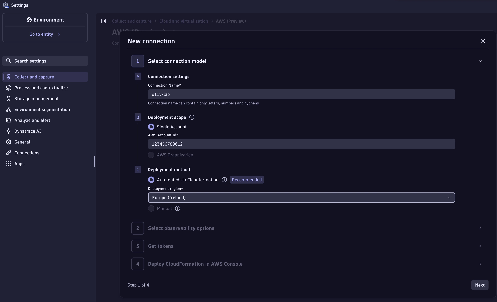
4.  **Observability Options**: Choose the "Recommended observability path" and select your regions (ensure `us-east-1` is selected).
    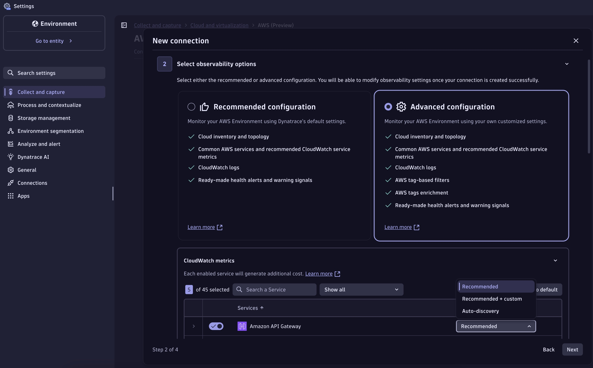
5.  **Tokens**: Provide the tokens generated in the previous step.
    
6.  **Deployment**: Deploy the CloudFormation template.
    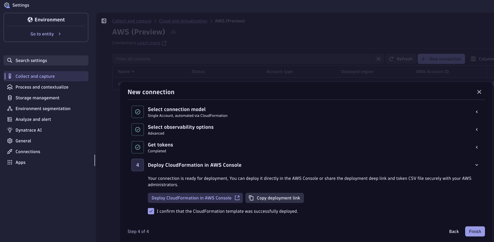
    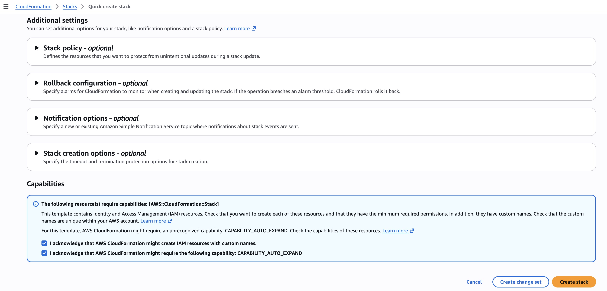

Once the wizard completes, you will see your AWS connection status change to **Healthy**.
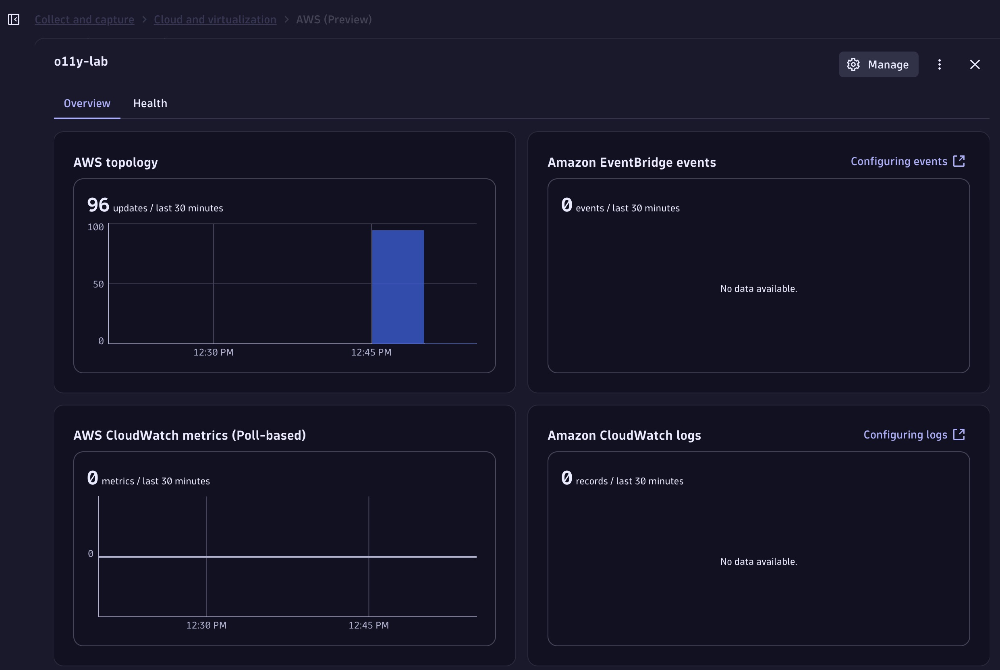

Finally we are reaching the point when Dynatrace is going to be used. Out components should be visible in new `Services` application.

Let's take a look at AWS Lambda example:

Lambda function overview:
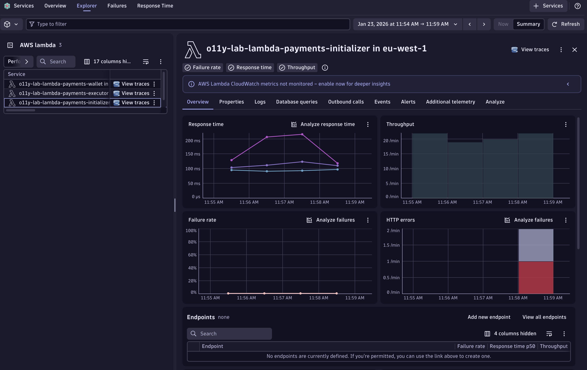

Logs are correlated with particular Lambda:
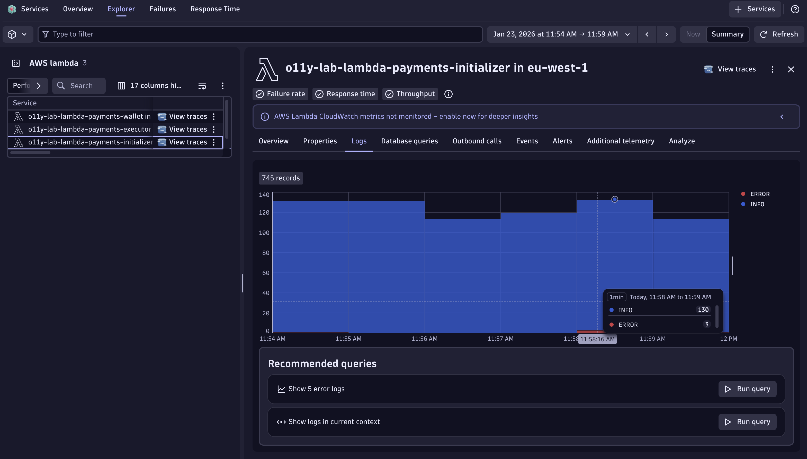

Outbount calls:
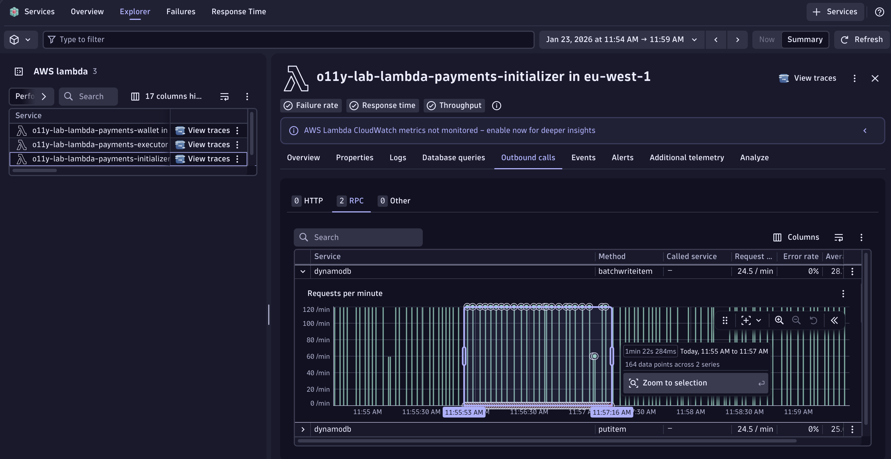

## Instrumentation

What is instrumentation?
Instrumentation refers to the process of embedding mechanisms in an application to collect telemetry data such as traces, metrics, and logs. Modern, distributed applications can be complex to debug, and frameworks like OpenTelemetry address this by standardising data collection across various services and languages.

OpenTelemetry gives developers two main ways to instrument the application:

- **Code-based solution**: via APIs and SDKs for languages like C++, C#/.NET, Go, Java, JavaScript, Python, Ruby, Rust (a complete list of supported languages can be found on the [official website](https://opentelemetry.io/docs/languages/)).
- **Zero-code solutions**: the best way to get started with instrumenting your application or if you cannot modify the source code.

> **IMPORTANT**:
> You can use both solutions simultaneously.

#### OpenTelemetry

OpenTelemetry is an open-source observability framework that provides a set of APIs and SDKs for instrumenting applications to collect telemetry data such as traces, metrics, and logs. It standardizes data collection across various services and languages, making it easier to monitor and troubleshoot distributed applications.

##### How does it work?

- When your Lambda function is called for the first time, the Lambda layer spins up an instance of the OpenTelemetry Collector.
- The Collector registers itself with the **Lambda Extensions API** and **Telemetry API**, allowing it to receive notifications whenever your function is invoked, when logs are emitted, or when the execution context is about to be shut down.
- The Collector uses a specialized **decouple processor**, which separates data collection from data export. This means your Lambda function can return immediately, without waiting for telemetry to be sent.
- If the Collector has not finished sending all telemetry before the function returns, it will resume exporting during the next invocation or just before the Lambda context is fully terminated. This significantly reduces any added latency to your function runtime. It also does not increase costs.

#### Dynatrace meets OpenTelemetry

To use OpenTelemetry in connection to Dynatrace, you can leverage OneAgent, a dedicated instrumentation agent. Dynatrace provides an AWS Lambda layer that contains OneAgent, making it straightforward to collect telemetry data (logs, metrics, and traces) and send it to Dynatrace.

##### Configuration Options

You can configure and deploy this setup using a variety of methods:

- JSON files
- Environment variables
- Terraform
- AWS SAM
- Serverless Framework
- AWS CloudFormation

In this demo, we use the Terraform module to automatically attach this layer to our functions.

##### Benefits for Serverless Environments

By adopting this architecture:

- Standardized observability – one common way to collect traces, metrics, and logs across all serverless functions and managed services.
- End-to-end distributed tracing – visibility into request flows across short-lived functions, queues, APIs, and downstream services.
- Low operational overhead – designed to work with ephemeral, auto-scaling workloads without managing agents or servers.
- Faster troubleshooting – quick correlation of cold starts, latency spikes, errors, and retries in highly dynamic serverless systems.
- Consistent context propagation – trace context is preserved across async and event-driven boundaries (HTTP, messaging, streams).


Dynatrace provides you with a dedicated AWS Lambda layer that contains the Dynatrace extension for AWS Lambda. You need to add the publicly available layer for your runtime and region to your function.
[Dynatrace docs: Trace Lambda functions](https://docs.dynatrace.com/docs/ingest-from/amazon-web-services/integrate-into-aws/aws-lambda-integration/trace-lambda-functions)

Dynatrace offers quite good support for onboarding users. To retrieve all necessary configuration you have to:

1.  Log into your Dynatrace account
2.  Open `Dynatrace hub` application and from AWS Lambda choose Set up
    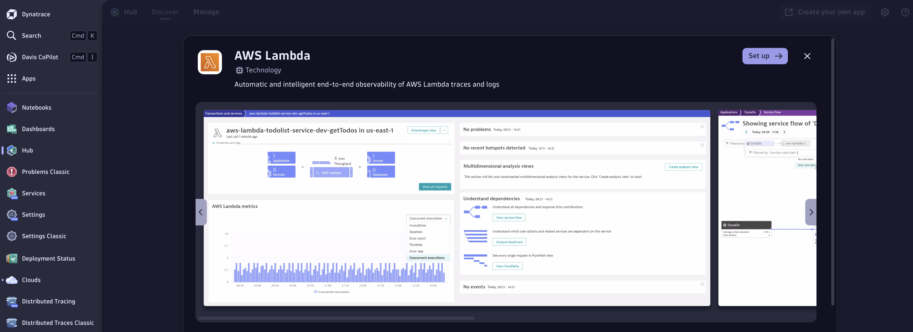
3.  The configuration wizard opens the possibility to retrieve all necessary values to go through the above example. An event Terraform snippet is also provided.
    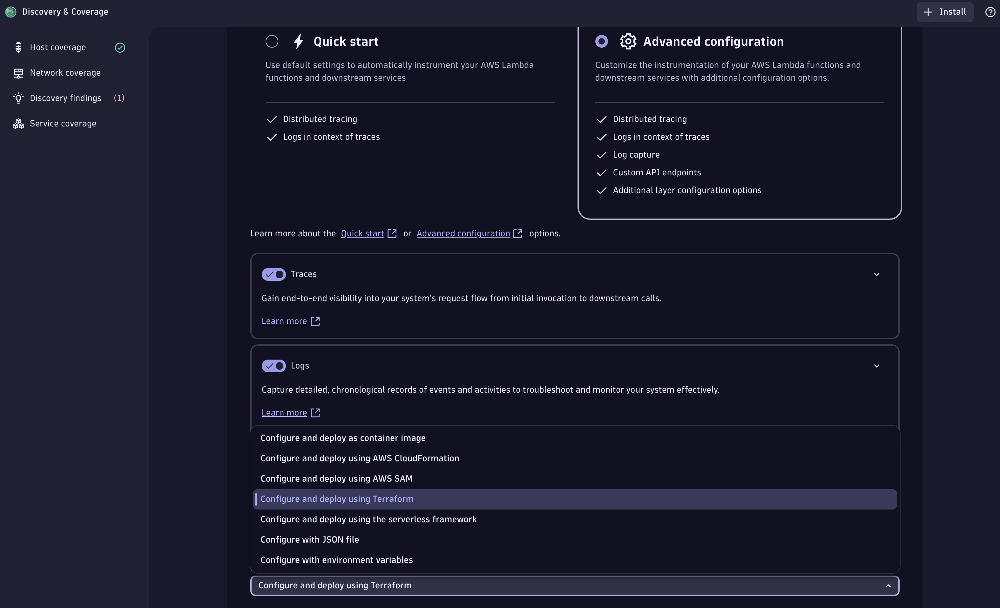
    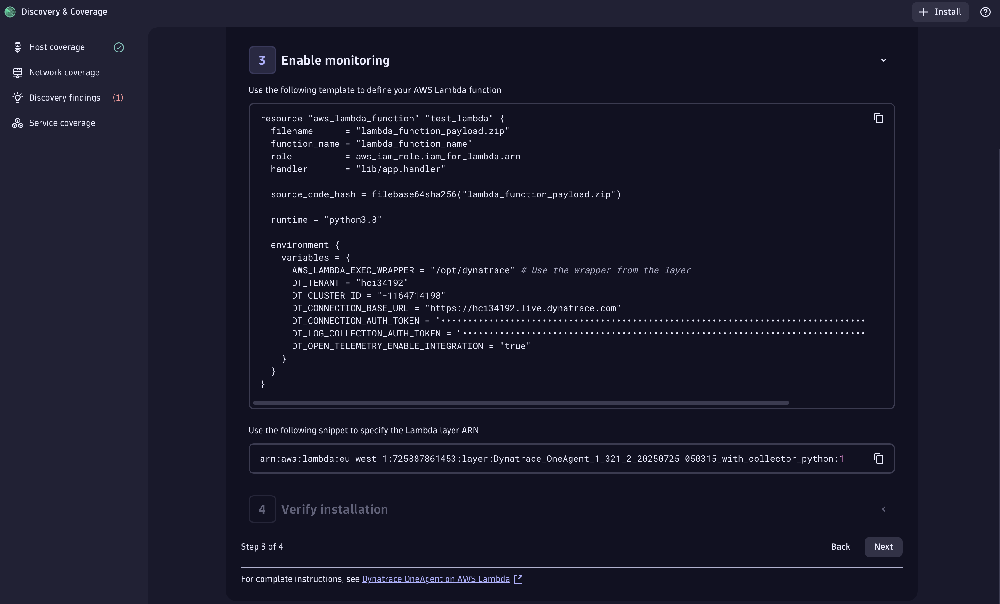

## Cream de la creme... Confirmation!

Speaking of confirmation, from that point you can easly navigate to `Distributed tracing` application

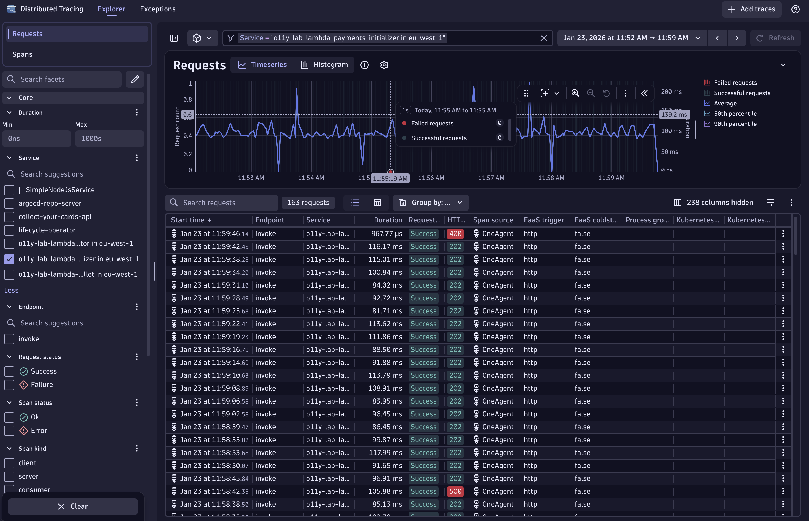

## Out-of-the-box solution

When working with AWS Lambda functions and Dynatrace OneAgent Lambda Layer, it's important to understand how the automatic instrumentation works and how to enhance it for better observability.
As I mentioned in the previous chapter, Dynatrace provides you with a dedicated AWS Lambda layer that contains the Dynatrace extension for AWS Lambda. OK, so what we are getting out of the box?

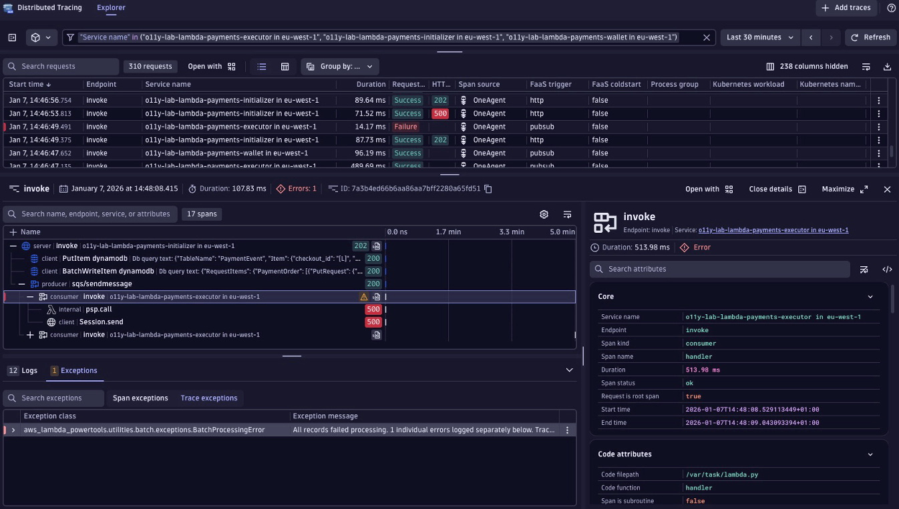

### What You Get Automatically

Out of the box, after attaching the Dynatrace OneAgent Lambda Layer to your function, you gain immediate visibility into AWS Lambda executions **without writing a single line of code**. This automatic instrumentation leverages OpenTelemetry standards and integrates seamlessly with the Dynatrace backend to deliver essential observability features.

**Automatic Trace Collection:**

- **Lambda Invocations**: Each Lambda execution is automatically traced and visualized in Dynatrace as an `invoke` endpoint, with a root span labeled as `SERVER`
- **HTTP/HTTPS Calls**: Outbound HTTP requests (e.g., to PSP API) are captured as child spans with `CLIENT` span kind, showing method, URL, status code, and duration
- **AWS SDK Operations**: All AWS service calls are automatically instrumented:
  - **DynamoDB**: `PutItem`, `GetItem`, `Query`, `BatchWriteItem` with table names and consumed capacity
  - **SQS**: `SendMessage`, `ReceiveMessage`, `DeleteMessage` with queue URLs and message counts
  - **API Gateway**: Integration latency, request/response metadata
- **Distributed Trace Context**: Trace IDs and span IDs are automatically propagated across service boundaries via W3C Trace Context headers

**Automatic Metrics Collection:**

- Lambda execution duration (cold start vs warm start)
- Memory usage and billed duration
- Concurrent executions
- Error rates and throttles
- Integration with CloudWatch metrics

**Automatic Log Correlation:**

- Lambda logs from CloudWatch are automatically correlated with traces using trace IDs
- Error and exception stack traces are linked to the corresponding distributed trace
- Log entries appear in the trace waterfall view for easy navigation

**Service Discovery and Mapping:**

- Automatic detection of service dependencies (Lambda → DynamoDB, Lambda → SQS, etc.)
- Dynamic service flow maps showing request paths through your architecture
- Entity relationships (which Lambda calls which service)

Each Lambda invocation is visualized in Dynatrace as an `invoke` endpoint, with a root span labeled as `SERVER`. Any downstream activities triggered during the execution—such as HTTP calls to the PSP—are represented as child spans, clearly distinguished by their HTTP method, e.g., `POST`.

### Understanding `span.kind` in OpenTelemetry

In OpenTelemetry, each span can include a `span.kind` attribute that describes the role of the span within a trace. This attribute indicates how the span relates to a remote operation or to other spans, and helps tracing systems understand and visualize the structure of distributed traces. If not explicitly set, the default kind is `INTERNAL`.

The available span kinds are:

| Span Kind  | Purpose                                                                                                     |
| ---------- | ----------------------------------------------------------------------------------------------------------- |
| `SERVER`   | Indicates that the span covers server-side handling of a remote request, such as receiving an HTTP request. |
| `CLIENT`   | Represents an outbound request to a remote server, like an HTTP call or database query.                     |
| `PRODUCER` | Describes the act of producing a message to a message broker or stream.                                     |
| `CONSUMER` | Describes the act of receiving or processing a message from a broker or stream.                             |
| `INTERNAL` | Used for spans that represent internal work within a component that is not visible to external systems.     |

## Business-aware telemetry

So far we focused on different observability pillars and how to implement them in serverless payments system to prove that the system is observable, but we haven't discussed what should be done to prove that **business** is observable.

### What is the difference between business observability and system observability?

| Aspect                  | **System Observability**                             | **Business Observability**                              |
| ----------------------- | ---------------------------------------------------- | ------------------------------------------------------- |
| **Primary focus**       | Technical health of systems                          | Health of business outcomes                             |
| **Key question**        | _Is the system working correctly?_                   | _Is the business performing as expected?_               |
| **Typical data**        | Traces, metrics, logs (latency, errors, CPU, memory) | Business KPIs (orders, revenue, conversion rate, churn) |
| **Audience**            | Engineers, SREs, DevOps                              | Product, business, engineering leadership               |
| **Detection of issues** | Infrastructure failures, latency, errors             | Revenue loss, dropped transactions, customer impact     |
| **Granularity**         | Services, endpoints, functions                       | Users, journeys, transactions                           |
| **Example insight**     | "Checkout API latency increased by 300ms"            | "Checkout latency caused a 5% drop in completed orders" |

#### How they work together

- **System observability** explains what is technically broken and why.
- **Business observability** explains why it matters to the business.

### Business event logging pattern

**Purpose**: Bridge technical traces with business metrics for multi-stakeholder observability.

All Lambda functions in this demo implement a consistent business event logging pattern that generates structured logs optimized for business analysis, not just technical debugging.

**Implementation** (used across all Lambdas):

```python
# From src/lambda-payments-initializer/lambda.py
def log_business_event(
    msg: str,
    event_name: str,
    event_type:str,
    checkout_id: str,
    outcome: str,
    stage: str = "INITIALIZATION",
    data: dict = None
):
    logger.info(msg,
        event_name=event_name,
        event_type=event_type,
        event_domain="payments",
        event_provider="payment-service",
        event_version="1.0",
        payment_checkout_id=checkout_id,
        payment_outcome=outcome,
        payment_stage=stage,
        biz_timestamp=datetime.now(timezone.utc).isoformat(),
        **(data or {})
    )
```

> **Note on logs**:
> Structured logs are emitted using AWS Lambda Powertools Logger. When the Dynatrace OneAgent Lambda Layer is enabled, logs are automatically collected and correlated with distributed traces through automatic injection of dt.trace_id and dt.span_id at ingestion time, removing the need for manual correlation.

**Event Taxonomy**:

| Stage           | Event Name                                                                  | Event Type        | Outcome Values    |
| --------------- | --------------------------------------------------------------------------- | ----------------- | ----------------- |
| REQUEST         | `payment.request.received`                                                  | received          | RECEIVED          |
| VALIDATION      | `payment.checkout.rejected`                                                 | rejected          | REJECTED          |
| INITIALIZATION  | `payment.checkout.initiated`, `payment.checkout.queued`                     | initiated, queued | VALIDATED, QUEUED |
| EXECUTION       | `payment.wallet.queued`                                                     | queued            | SUCCESS, FAILURE  |
| PSP_INTEGRATION | `payment.psp.response`                                                      | response          | SUCCESS, FAILURE  |
| SETTLEMENT      | `payment.order.settled`, `payment.checkout.settled`, `payment.order.failed` | settled, failed   | SUCCESS, FAILURE  |

**Benefits**:

- Clear separation of business and technical signals. Business events are emitted intentionally and explicitly, instead of being inferred from low-level traces or logs.
- End-to-end visibility. The stage-based event taxonomy models the full lifecycle of a payment, from request to settlement.
- Trace-to-business correlation. Business events are automatically correlated with distributed traces through ingestion-time enrichment.
- Multi-stakeholder observability from a single source of truth
- Business-driven reliability conversations. By tying reliability directly to payment outcomes, discussions shift from infrastructure metrics to customer impact.

**Example Log Output**:

```json
{
  "level": "INFO",
  "message": "Payment checkout initiated",
  "event_name": "payment.checkout.initiated",
  "event_type": "initiated",
  "event_domain": "payments",
  "event_provider": "payment-service",
  "event_version": "1.0",
  "payment_checkout_id": "chk-123",
  "payment_outcome": "VALIDATED",
  "payment_stage": "INITIALIZATION",
  "amount_total": "149.99",
  "amount_currency": "USD",
  "order_count": 3,
  "biz_timestamp": "2025-12-02T22:30:00.123Z",
  "timestamp": "2025-12-02T22:30:00.123Z",
  "aws_request_id": "abc-123-def",
  "function_name": "o11y-lab-payments-initializer",
  "dt.trace_id": "abc123def456...",
  "dt.span_id": "789xyz..."
}
```

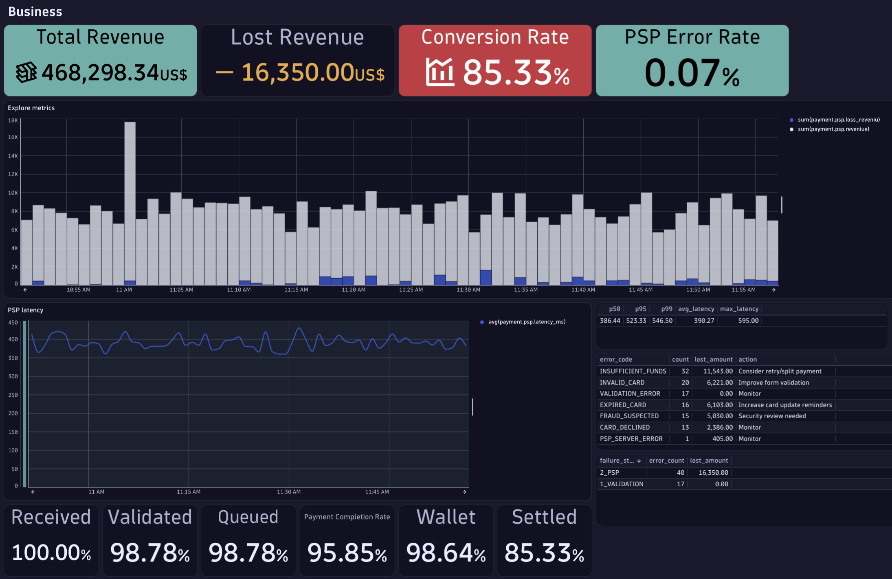

## Defining business-aligned SLIs and SLOs

Service Level Indicators (SLIs) should measure **what users actually experience**, not internal implementation details.  
Following the SRE Google recommendations from, SLIs are best expressed as **event-based ratios**:

> **SLI = number of good events / number of valid events**

This formulation avoids misleading averages and ensures that reliability is measured from the user’s perspective.

### Understanding the payment user journey

In modern payment systems, the user journey is split across multiple phases:

1. **Synchronous phase**  
   The user submits a payment request and receives an immediate **HTTP 202 (Accepted)** response.

2. **Asynchronous processing phase**  
   Payment processing continues in the background (e.g., message queue → payment service provider → settlement).

3. **Notification phase**  
   The user is eventually informed of the final payment outcome via webhook, email, or in-app notification.

Because users do not wait for settlement synchronously, **reliability must be measured differently for each phase**.

### Types of SLIs in an asynchronous payment system

This architecture naturally leads to **two distinct categories of SLIs**.
This SLI follows the **Good / Total Events pattern** recommended by Google SRE.

#### User-facing API SLIs

These SLIs reflect the user’s immediate experience when interacting with the API.

- **Example SLI**: API request latency for `POST /payments`
- **Measurement model**:
  - **Good event**: request completed within the latency objective (e.g. ≤ 300 ms) **AND** response status code is not 5xx.
  - **Total events**: all valid payment initiation requests

Latency SLIs are typically **derived from request-level telemetry** (e.g. HTTP server spans collected via distributed tracing), but the **SLI itself is defined as an event ratio**, not as raw trace data.

#### Processing outcome SLIs (Asynchronous)

These SLIs capture whether the payment workflow ultimately completes successfully.  
They reflect the **end-to-end outcome** of the system, not individual component behavior.

### End-to-end processing latency SLI

Since users do not synchronously wait for payment settlement, this is often treated as an internal metric. However, users **do** have an expectation of timeliness (e.g., receiving a confirmation within minutes).

- **Measurement**: time from payment initiation to final settlement
- **SLO Target**: 99% of payments settle within 2 minutes.
- **Purpose**: Ensures that while the system is async, it doesn't degrade into "functionally unavailable" (e.g., taking 4 hours to process).

Internal SLIs provide **engineering insight**, but limits represent the **user's tolerance for delay**.

### Payment success rate SLI (Availability)

The primary availability indicator for the payment platform is the **Payment Success Rate**.

- **Measurement model**:
  - **Total events**: all payment checkout attempts that enter the system and reach a terminal state.
- **Measurement model**:
  - **Good events**: valid payments that successfully complete settlement.
  - **Total Valid Events**: `Total Requests` - `User/Business Errors`
    We explicitly filter out invalid requests from the denominator. A user failing to pay because they have no money is not a system reliability failure.

#### SLO definition

| SLO Target | Evaluation Window | Error Budget |
| ---------: | ----------------- | ------------ |
|      99.5% | 30-day rolling    | 0.5%         |

A 99.5% SLO means that **no more than 0.5% of valid payment attempts may fail due to system issues** within the evaluation window.

### Business conversion rate (KPI)

The **Business Conversion Rate** measures the percentage of initiated payments that successfully settle.

While this metric is critical for business outcomes, it is **not a reliability SLI**.

| Conversion Rate | Business Interpretation                 |
| --------------- | --------------------------------------- |
| > 95%           | Healthy funnel                          |
| < 95%           | Potential UX, PSP, or fraud-rule issues |

A decline in conversion rate may signal reliability problems, but **it does not, by itself, indicate an SLO violation**.

### Error budget policy

Error Budgets translate SLOs into **concrete operational decisions**

| Error Budget Consumption | Operational Response                                           |
| ------------------------ | -------------------------------------------------------------- |
| < 50%                    | Normal feature development                                     |
| 50–75%                   | Increased testing and change scrutiny                          |
| 75–100%                  | Reliability work prioritized, risky changes deferred           |
| > 100% (SLO breached)    | Deployment freeze (except critical fixes), postmortem required |

**Example policy**:  
If the Payment Success Rate drops below its 99.5% SLO, all non-critical deployments are paused until the error budget is restored.

This approach ensures a **healthy balance between feature velocity and system reliability**.

### Implementation note

**Note**: These structured logs can be extracted as Dynatrace Business Events via [OpenPipeline](https://docs.dynatrace.com/docs/platform/openpipeline/use-cases/business-events) for advanced business analytics and SLO monitoring.

## Release observability

Infrastructure, traces, and business metrics provide operational visibility — but without **change context**, root cause analysis remains incomplete.

When incidents occur, the first diagnostic question is: _"What changed?"_

Release observability addresses this by capturing **who** deployed **what**, **where**, and **when**, and correlating deployment events with anomalies, latency degradation, and business impact.

### Why release context matters

Deployment frequency is high. A Lambda function may be updated multiple times per day. Without release telemetry, operators are forced to manually investigate:

- Whether an error predates the most recent deployment
- Which version introduced a latency regression
- Whether observed behavior is a new defect or existing condition

Release observability shifts the diagnostic model from **"What broke?"** to **"Which version introduced the failure?"** — directly reducing Mean Time to Resolution (MTTR).

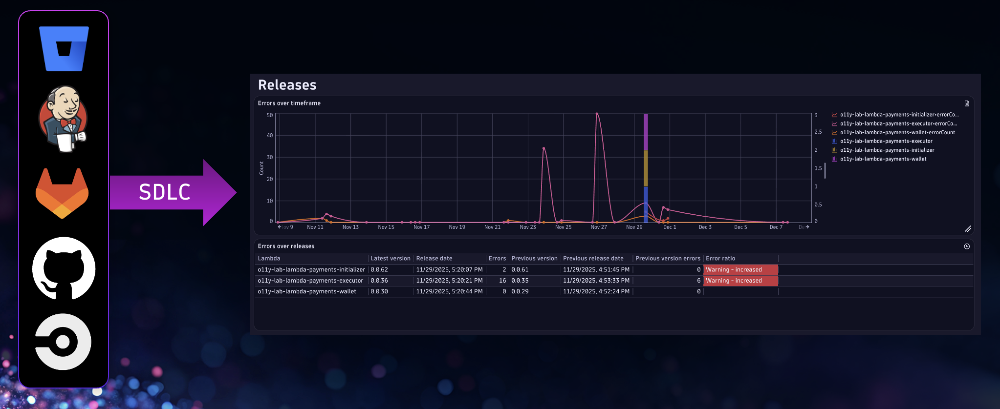

### SDLC events in Dynatrace

Dynatrace ingests [Software Development Lifecycle (SDLC) events](https://docs.dynatrace.com/docs/discover-dynatrace/references/semantic-dictionary/model/sdlc-events) that represent discrete stages in the software delivery process. These events follow a semantic model with consistent attribute namespaces:

| Namespace         | Purpose                                 | Example Attributes                                                              |
| ----------------- | --------------------------------------- | ------------------------------------------------------------------------------- |
| `cicd.pipeline`   | CI/CD pipeline execution tracking       | `cicd.pipeline.id`, `cicd.pipeline.run.id`, `cicd.pipeline.run.outcome`         |
| `cicd.deployment` | Deployment lifecycle (started/finished) | `cicd.deployment.id`, `cicd.deployment.status`, `cicd.deployment.release_stage` |
| `artifact`        | Build artifact identification           | `artifact.id`, `artifact.name`, `artifact.version`                              |
| `vcs`             | Version control context                 | `vcs.ref.base.name`, `vcs.ref.base.revision`, `vcs.repository.url.full`         |

SDLC events are classified by `event.type` (e.g., `deployment`, `build`, `run`) and `event.status` (e.g., `started`, `finished`), enabling precise lifecycle tracking.

**Correlation Logic:**

| Telemetry Signal       | Attribution Key                                                           |
| ---------------------- | ------------------------------------------------------------------------- |
| **Anomaly Detection**  | `cicd.deployment.id` — Correlates failure to specific deployment          |
| **Business KPI Drop**  | `artifact.version` — Identifies active software version                   |
| **Latency Regression** | `vcs.ref.base.revision` — Narrows investigation to the introducing commit |

### The observability feedback loop

Release observability completes the SRE feedback loop by linking runtime signals to deployment context:

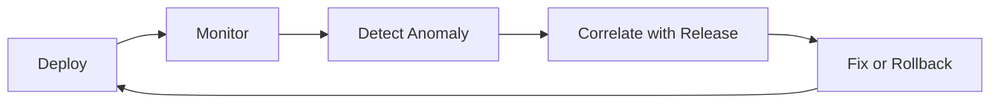
```mermaid
flowchart LR
    Deploy[Deploy] --> Monitor[Monitor]
    Monitor --> Detect[Detect Anomaly]
    Detect --> Correlate[Correlate with Release]
    Correlate --> Fix[Fix or Rollback]
    Fix --> Deploy
```

This enables **closed-loop operational feedback** across stakeholders.

> **Key takeaway**: Release observability transforms incident response from "What broke?" to "Which deployment introduced the failure, and what changed?" — reducing investigation time from hours to minutes.
